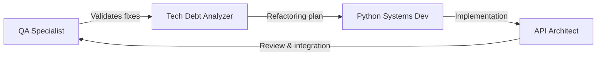
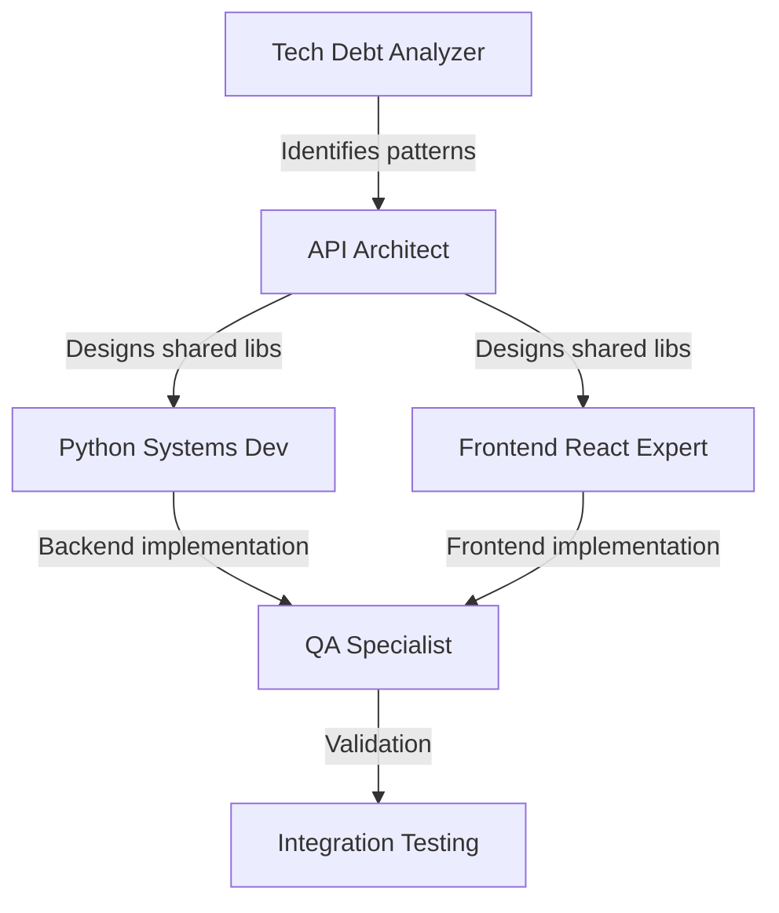
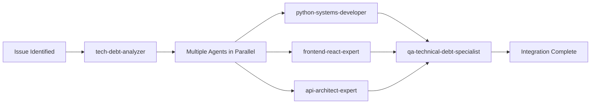
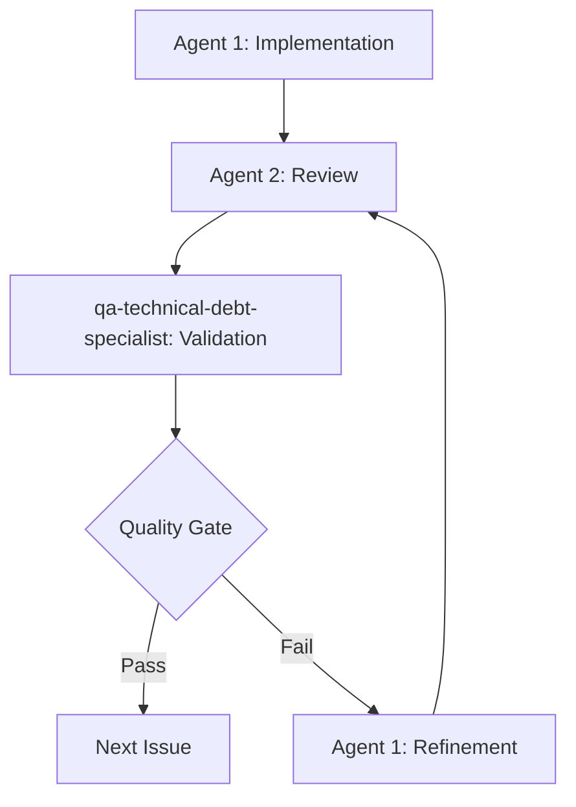
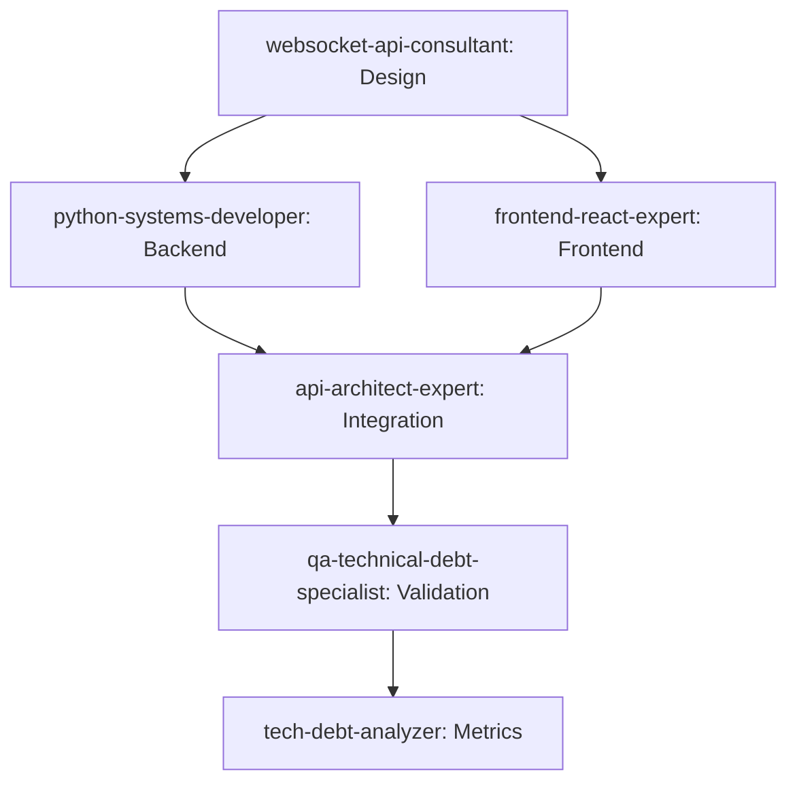

# Sprint 4: Agent Team Methodology
## Technical Debt Remediation with Specialized AI Agents

**Document Version**: 1.0
**Date**: September 29, 2025
**Sprint**: Sprint 4 - Technical Debt Focus

---

## 🤖 Agent Team Overview

### **Specialized Agent Roster**
1. **websocket-api-consultant** - WebSocket architecture and real-time communication expert
2. **python-systems-developer** - Backend systems, camera integration, and hardware abstraction
3. **frontend-react-expert** - React/TypeScript, bundle optimization, and UI architecture
4. **tech-debt-analyzer** - Code quality analysis and refactoring strategies
5. **api-architect-expert** - API design, service boundaries, and system integration
6. **qa-technical-debt-specialist** - Quality assurance focused on technical debt remediation

---

## 🎯 Phase-Based Agent Deployment Strategy

### **Phase 1: Critical Security & Stability (Week 1 - 24 hours)**

#### **Lead Agents**: qa-technical-debt-specialist + tech-debt-analyzer
#### **Supporting Agents**: python-systems-developer, api-architect-expert

**Workflow**:


#### **Issue Assignment**:
- **Issue #5 (JWT Secret)**: python-systems-developer → qa-technical-debt-specialist
- **Issue #4 (Real-time Client)**: websocket-api-consultant → frontend-react-expert → qa-technical-debt-specialist
- **Issue #1 (Error Handling)**: python-systems-developer → api-architect-expert → qa-technical-debt-specialist
- **Issue #2 (CORS)**: api-architect-expert → qa-technical-debt-specialist
- **Issue #6 (Error Boundaries)**: frontend-react-expert → qa-technical-debt-specialist

#### **Quality Gates**:
1. **Security Review**: All changes reviewed by qa-technical-debt-specialist
2. **Integration Testing**: Each fix tested in isolation and together
3. **Deployment Validation**: Changes verified in staging environment

---

### **Phase 2: Code Duplication Elimination (Week 2-3 - 32 hours)**

#### **Lead Agents**: tech-debt-analyzer + api-architect-expert
#### **Supporting Agents**: python-systems-developer, frontend-react-expert

**Workflow**:


#### **Agent Collaboration Pattern**:

**Day 1-2: Analysis & Design**
- **tech-debt-analyzer**: Deep dive into code duplication patterns
- **api-architect-expert**: Design shared library interfaces
- **qa-technical-debt-specialist**: Define testing requirements

**Day 3-5: Backend Implementation**
- **python-systems-developer**: Implement `common/` shared modules
- **api-architect-expert**: Review service integration patterns
- **qa-technical-debt-specialist**: Create backend tests

**Day 6-8: Frontend Implementation**
- **frontend-react-expert**: Migrate frontend to shared patterns
- **qa-technical-debt-specialist**: Create frontend tests
- **tech-debt-analyzer**: Validate duplication reduction

---

### **Phase 3: Architecture Improvements (Week 4-5 - 35 hours)**

#### **Lead Agents**: api-architect-expert + websocket-api-consultant
#### **Supporting Agents**: All other agents as needed

**Focus Areas by Agent**:

#### **websocket-api-consultant**:
- **Issue #4**: Real-time client architecture
- **Issue #20**: WebSocket connection management
- **Performance**: Real-time system optimization

#### **python-systems-developer**:
- **Issue #10**: Camera interface coupling
- **Issue #27**: Interface abstractions
- **Issue #30**: Dependency injection

#### **frontend-react-expert**:
- **Issue #37**: Bundle optimization
- **Issue #25**: Component architecture
- **Issue #46**: TypeScript improvements

#### **api-architect-expert**:
- **Issue #26**: Service boundaries
- **Issue #39**: Input validation
- **Overall**: Service integration architecture

---

### **Phase 4: Testing & Documentation (Week 6 - 30 hours)**

#### **Lead Agent**: qa-technical-debt-specialist
#### **Supporting Agents**: All agents contributing to their specializations

**Testing Strategy by Agent**:

#### **qa-technical-debt-specialist** (Lead):
- **Issue #31**: Overall test coverage strategy
- **Issue #33**: Integration test framework
- **Quality**: End-to-end validation

#### **python-systems-developer**:
- Backend unit tests for refactored components
- Hardware integration test improvements
- Performance testing for camera systems

#### **frontend-react-expert**:
- Frontend component testing
- Bundle size validation
- User experience testing

#### **websocket-api-consultant**:
- Real-time system stress testing
- WebSocket connection reliability tests

---

## 🔄 Iteration Methodology

### **Daily Agent Standup Process**

#### **Daily Workflow (15 minutes)**:
1. **Lead Agent Reports**: Current progress and blockers
2. **Cross-Agent Dependencies**: What each agent needs from others
3. **Quality Check**: qa-technical-debt-specialist validates previous day's work
4. **Day Planning**: Assign specific tasks and collaboration needs

#### **Example Daily Standup**:
```
User: "Daily standup for Sprint 4 Day 5"

qa-technical-debt-specialist:
- "Validated JWT secret fix from python-systems-developer ✅"
- "Need integration tests for CORS changes from api-architect-expert"
- "Blocker: Waiting for real-time client refactor from websocket-api-consultant"

websocket-api-consultant:
- "Real-time client refactor 80% complete"
- "Need frontend-react-expert to review React integration patterns"
- "ETA: End of day for handoff to QA"

frontend-react-expert:
- "Error boundaries implementation complete ✅"
- "Ready to integrate real-time client changes"
- "Need api-architect-expert input on service communication patterns"
```

### **Quality Validation Checkpoints**

#### **MANDATORY: Playwright Testing After Each Task**
```
🚨 CRITICAL REQUIREMENT: Every single task completion MUST be verified with Playwright testing

WORKFLOW FOR EACH ISSUE:
1. Agent implements the fix
2. Agent writes Playwright test for the specific functionality
3. Agent runs Playwright test to verify fix works
4. Agent provides test results and screenshots
5. Only then mark issue as complete

NO EXCEPTIONS - Every task needs Playwright verification before moving to next issue.
```

#### **Every 48 Hours**: Technical Debt Metrics Review
```
tech-debt-analyzer:
- Run automated code analysis
- Generate duplication reduction metrics
- Identify newly introduced technical debt
- Report progress against 4-phase roadmap
- Verify all completed tasks still pass Playwright tests
```

#### **Weekly**: Architecture Review
```
api-architect-expert:
- Review service boundary changes
- Validate API design consistency
- Assess security implications
- Recommend architectural adjustments
```

### **Continuous Integration with Agents**

#### **Pre-Commit Agent Review**:
```bash
# Automated agent consultation before commits
agent-review --phase=current --changes=staged --agents=qa-technical-debt-specialist,tech-debt-analyzer
```

#### **Build Pipeline Integration**:
```yaml
# .github/workflows/sprint-4-agent-validation.yml
name: Agent-Assisted Quality Gates
on: [push, pull_request]

jobs:
  agent-validation:
    steps:
      - name: Technical Debt Analysis
        run: invoke-agent tech-debt-analyzer --task="validate-changes" --files=${{ github.event.commits[0].modified }}

      - name: QA Review
        run: invoke-agent qa-technical-debt-specialist --task="quality-gate" --changes=${{ github.sha }}
```

---

## 🧪 Testing Strategy by Agent Specialization

### **python-systems-developer**: Backend Testing
```python
# Test framework for backend changes
@pytest.mark.agent_validated
class TestSharedErrorHandling:
    """Tests validated by python-systems-developer agent."""

    def test_common_middleware_consistency(self):
        # Test shared error handling across all services
        pass

    def test_camera_interface_abstraction(self):
        # Test improved camera coupling
        pass
```

### **frontend-react-expert**: Frontend Testing
```typescript
// Test framework for frontend changes
describe('Agent-Validated Components', () => {
  // Tests designed by frontend-react-expert

  test('Error boundaries prevent cascade failures', () => {
    // Test error boundary implementation
  })

  test('Bundle size within performance budgets', () => {
    // Test bundle optimization results
  })
})
```

### **websocket-api-consultant**: Real-Time Testing
```typescript
// Real-time system validation
describe('WebSocket Architecture', () => {
  // Tests designed by websocket-api-consultant

  test('Connection management under load', () => {
    // Stress test WebSocket connections
  })

  test('Graceful reconnection handling', () => {
    // Test reconnection logic
  })
})
```

---

## 📊 Success Metrics by Agent

### **tech-debt-analyzer**: Code Quality Metrics
- **Duplication Reduction**: Track from 30% → <10%
- **Cyclomatic Complexity**: Reduce functions >15 complexity
- **Code Smells**: Eliminate critical code smells
- **Technical Debt Ratio**: Improve from C+ to A-

### **qa-technical-debt-specialist**: Quality Metrics
- **Test Coverage**: Improve from 60% → >85%
- **Bug Detection**: Catch regressions before deployment
- **Quality Gates**: 0 failures in CI/CD pipeline
- **Security Validation**: 0 security issues in static analysis

### **api-architect-expert**: Architecture Metrics
- **Service Coupling**: Reduce cross-service dependencies
- **API Consistency**: Standardize response formats
- **Security Posture**: Implement proper validation/authorization
- **Integration Health**: 0 service integration failures

### **websocket-api-consultant**: Real-Time Metrics
- **Connection Reliability**: >99.9% connection success rate
- **Latency**: <100ms average message latency
- **Throughput**: Handle 100+ concurrent connections
- **Recovery Time**: <5s reconnection after network issues

### **frontend-react-expert**: UI/UX Metrics
- **Bundle Size**: Reduce from 2.5MB → <800KB initial load
- **Performance**: Lighthouse score >90
- **Error Recovery**: 0 white-screen errors
- **Development Experience**: <2min hot-reload time

### **python-systems-developer**: System Metrics
- **Hardware Integration**: 0 camera interface failures
- **Performance**: <50ms average API response time
- **Resource Usage**: <80% CPU/memory utilization
- **Reliability**: >99.9% service uptime

---

## 🚀 Agent Collaboration Patterns

### **Parallel Development Pattern**


### **Sequential Validation Pattern**


### **Cross-Pollination Pattern**


---

## 📋 Weekly Sprint Planning with Agents

### **Sprint Planning Session (2 hours)**

#### **Hour 1: Agent Capability Assessment**
- **Each agent** reviews assigned issues and estimates effort
- **Dependencies identified** between agent work streams
- **Risk assessment** for each agent's deliverables
- **Resource allocation** and timeline validation

#### **Hour 2: Integration Planning**
- **qa-technical-debt-specialist** defines quality gates
- **api-architect-expert** reviews service integration impacts
- **Conflict resolution** for competing approaches
- **Success metrics** defined per agent

### **Mid-Sprint Review (1 hour)**
- **Progress check** against phase milestones
- **Quality metrics** review by qa-technical-debt-specialist
- **Technical debt reduction** metrics from tech-debt-analyzer
- **Adjustment planning** for remainder of sprint

### **Sprint Retrospective (1 hour)**
- **Agent effectiveness** evaluation
- **Collaboration pattern** improvements
- **Tool and process** refinements
- **Next sprint** agent assignment optimization

---

## 🔧 Tools and Integration

### **Agent Communication Tools**
- **Shared Documentation**: All agents update common progress docs
- **Code Review Integration**: Agents participate in PR reviews
- **Automated Analysis**: Agents run on CI/CD pipeline
- **Metric Dashboards**: Real-time progress tracking

### **Quality Assurance Integration**
- **Pre-commit Hooks**: qa-technical-debt-specialist validation
- **Automated Testing**: Agent-generated test suites
- **Performance Monitoring**: Real-time metrics collection
- **Security Scanning**: Automated vulnerability detection

### **Development Workflow**
```bash
# Daily workflow with agents
$ git checkout -b feature/issue-5-jwt-security
$ invoke-agent python-systems-developer --task="implement-jwt-security" --issue=5
$ invoke-agent qa-technical-debt-specialist --task="validate-implementation" --pr=current
$ git commit -m "fix(security): Implement secure JWT handling"
$ invoke-agent tech-debt-analyzer --task="measure-improvement" --before-after
```

---

## 📈 Success Criteria

### **Phase Completion Criteria**

#### **Phase 1 Success**:
- All critical security issues resolved
- 0 security vulnerabilities in static analysis
- All changes validated by qa-technical-debt-specialist
- Production deployment confidence restored

#### **Phase 2 Success**:
- Code duplication reduced to <15%
- Shared libraries implemented and tested
- All services using consistent patterns
- Maintenance velocity increased by 30%

#### **Phase 3 Success**:
- Architecture improvements validated
- Service boundaries properly defined
- Performance targets met
- Scalability improvements implemented

#### **Phase 4 Success**:
- Test coverage >85%
- Documentation complete
- Developer onboarding <2 hours
- Zero technical debt regression

### **Overall Sprint Success**:
- **Code Health**: B- → A- rating
- **Technical Debt**: <10% duplication
- **Team Velocity**: 50% improvement in feature development
- **System Reliability**: >99.9% uptime
- **Developer Experience**: Dramatic improvement in development workflow

---

*This agent team methodology ensures systematic, high-quality technical debt remediation through specialized AI expertise and rigorous quality validation.*
